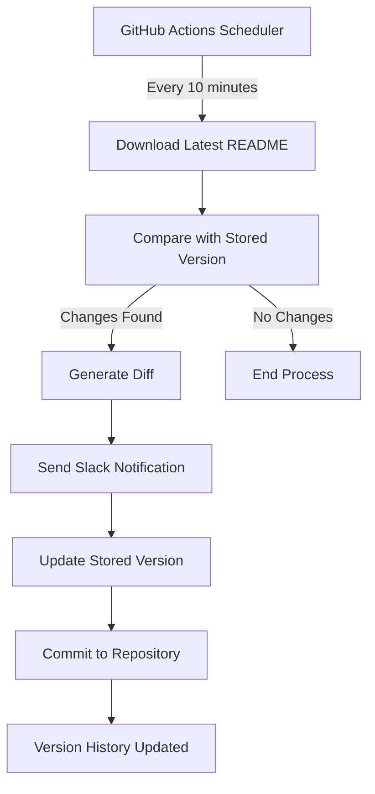

# 🔔 Complete Guide: Monitor Any GitHub Repository's README and Get Instant Slack Notifications

## 📖 Table of Contents
1. [Introduction & Use Cases](#introduction--use-cases)
2. [How It Works](#how-it-works)
3. [Prerequisites & Setup](#prerequisites--setup)
4. [Step-by-Step Implementation](#step-by-step-implementation)
5. [Advanced Configuration](#advanced-configuration)
6. [Troubleshooting Guide](#troubleshooting-guide)
7. [Best Practices & Security](#best-practices--security)
8. [Customization & Extensions](#customization--extensions)
9. [Alternative Implementations](#alternative-implementations)
10. [FAQ](#faq)

---

## 🎯 Introduction & Use Cases

Staying updated with changes in repositories you don't own can be challenging. This automated system solves that by monitoring any public GitHub repository's README file and instantly notifying you when changes occur.

### 🔥 Perfect For Monitoring:
- **Internship/Job Lists** (e.g., `Summer2026-Internships`)
- **Awesome Lists** (curated resource collections)
- **Configuration Templates** (dotfiles, configs)
- **Project Documentation** (API changes, setup instructions)
- **Security Advisories** (vulnerability disclosures)
- **Release Notes** (changelog updates)
- **Community Guidelines** (policy changes)

### 🎁 What You'll Get:
- ✅ Real-time change detection (every 10 minutes)
- ✅ Visual diff highlighting exactly what changed
- ✅ Instant Slack notifications with clickable links
- ✅ Version history stored in your own GitHub repo
- ✅ Zero maintenance once set up
- ✅ Completely free using GitHub Actions

---

## ⚡ How It Works



### 🔧 Technical Flow:
1. **Scheduled Trigger**: GitHub Actions runs on a cron schedule
2. **Content Fetch**: Downloads the latest README via GitHub's raw content API
3. **Diff Generation**: Compares new content with previously stored version
4. **Change Detection**: Uses Unix `diff` command for precise change tracking
5. **Notification**: Sends formatted diff to Slack webhook
6. **Version Control**: Commits the new version to maintain history
7. **Persistence**: Stores snapshot for next comparison cycle

---

## ⚙️ Prerequisites & Setup

### ✅ Required Accounts & Access
- **GitHub Account** (free tier sufficient)
- **Slack Workspace** with admin permissions to create webhooks
- **Target Repository** (any public GitHub repo you want to monitor)

### ✅ Technical Requirements
- Basic understanding of:
  - Git version control
  - YAML configuration files
  - GitHub Actions (we'll explain everything)
  - Slack webhook concepts

### ✅ Time Investment
- **Initial Setup**: 15-20 minutes
- **Maintenance**: Zero (fully automated)

---

## 🚀 Step-by-Step Implementation

### Step 1: 🏗️ Create Your Monitoring Repository

**Why**: This repository will house your monitoring workflow and store README snapshots.

1. **Navigate to GitHub**:
   - Go to [github.com](https://github.com)
   - Click the green "New" button or visit [github.com/new](https://github.com/new)

2. **Repository Configuration**:
   ```
   Repository name: readme-watcher
   Description: Automated README monitoring system
   Visibility: Private (recommended) or Public
   Initialize: ✅ Add a README file
   ```

3. **Create Repository**: Click "Create repository"

**💡 Pro Tip**: Use a descriptive name like `internship-tracker` or `awesome-list-monitor` to identify the purpose.

---

### Step 2: 🔑 Generate GitHub Personal Access Token (PAT)

**Why**: GitHub Actions needs permission to commit changes back to your repository.

#### Detailed PAT Creation:

1. **Access Token Settings**:
   - Navigate to [GitHub Settings](https://github.com/settings/tokens)
   - Click "Developer settings" (bottom left)
   - Select "Personal access tokens" → "Tokens (classic)"

2. **Generate New Token**:
   - Click "Generate new token (classic)"
   - **Note**: Add description like "README Monitor Bot"
   - **Expiration**: Choose 90 days or longer
   - **Scopes**: Enable these checkboxes:
     - ✅ `repo` (Full control of private repositories)
     - ✅ `workflow` (Update GitHub Action workflows)

3. **Security Best Practices**:
   ```
   ⚠️  CRITICAL: Copy and save this token immediately!
   ⚠️  GitHub will never show it again
   ⚠️  Store it in a password manager
   ⚠️  Never commit it to any repository
   ```

#### Alternative: Fine-Grained PAT (Recommended for 2024+)
```yaml
Resource owner: Your username
Repository access: Selected repositories → readme-watcher
Permissions:
  - Contents: Read and write
  - Metadata: Read
  - Actions: Write
```

---

### Step 3: 🔐 Configure Repository Secrets

**Why**: Secrets keep your tokens secure and accessible to GitHub Actions.

1. **Navigate to Secrets**:
   - Go to your `readme-watcher` repository
   - Click "Settings" tab
   - Select "Secrets and variables" → "Actions"

2. **Add GitHub Token**:
   - Click "New repository secret"
   - **Name**: `GH_PAT`
   - **Value**: Paste your Personal Access Token
   - Click "Add secret"

3. **Verify Setup**:
   - You should see `GH_PAT` listed under "Repository secrets"
   - The value will be hidden (shown as `***`)

---

### Step 4: 🔔 Create Slack Webhook

**Why**: Webhooks allow external services to send messages to your Slack channels.

#### Method 1: Slack App (Recommended)

1. **Create Slack App**:
   - Visit [api.slack.com/apps](https://api.slack.com/apps)
   - Click "Create New App"
   - Choose "From scratch"
   - **App Name**: "README Monitor"
   - **Workspace**: Select your target workspace

2. **Enable Incoming Webhooks**:
   - In your app dashboard, click "Incoming Webhooks"
   - Toggle "Activate Incoming Webhooks" to **On**
   - Click "Add New Webhook to Workspace"

3. **Configure Channel**:
   - Select the channel for notifications (e.g., `#dev-updates`)
   - Click "Allow"
   - Copy the generated webhook URL (starts with `https://hooks.slack.com/`)

#### Method 2: Legacy Incoming Webhooks

1. **Access Webhook Settings**:
   - Go to `https://[your-workspace].slack.com/apps/manage`
   - Search for "Incoming Webhooks"
   - Click "Add to Slack"

2. **Configure Integration**:
   - Choose target channel
   - Customize name and icon (optional)
   - Copy webhook URL

#### Add Webhook to GitHub Secrets

1. **Create New Secret**:
   - Repository Settings → Secrets and variables → Actions
   - Click "New repository secret"
   - **Name**: `SLACK_WEBHOOK_URL`
   - **Value**: Your webhook URL
   - Click "Add secret"

---

### Step 5: 📝 Create the GitHub Actions Workflow

**Why**: This file defines the automation logic and schedule.

1. **Create Workflow Directory**:
   - In your repository, create this folder structure:
   ```
   .github/
   └── workflows/
       └── readme-monitor.yml
   ```

2. **Add Workflow File**:
   - Click "Add file" → "Create new file"
   - Path: `.github/workflows/readme-monitor.yml`

3. **Complete Workflow Configuration**:

```yaml
name: 📊 README Monitor - Summer2026 Internships

on:
  # Runs every 10 minutes
  schedule:
    - cron: '*/10 * * * *'
  
  # Allows manual triggering
  workflow_dispatch:
    inputs:
      target_repo:
        description: 'Repository to monitor (owner/repo)'
        required: false
        default: 'vanshb03/Summer2026-Internships'
      file_path:
        description: 'File path to monitor'
        required: false
        default: 'README.md'

env:
  TARGET_REPO: ${{ github.event.inputs.target_repo || 'vanshb03/Summer2026-Internships' }}
  FILE_PATH: ${{ github.event.inputs.file_path || 'README.md' }}
  STORAGE_DIR: 'monitored-files'

jobs:
  monitor-readme:
    runs-on: ubuntu-latest
    
    steps:
      - name: 🔄 Checkout Repository
        uses: actions/checkout@v4
        with:
          token: ${{ secrets.GH_PAT }}
          fetch-depth: 0  # Full history for better diffs

      - name: 🏗️ Setup Monitoring Environment
        run: |
          # Create storage directory
          mkdir -p ${{ env.STORAGE_DIR }}
          
          # Create initial files if they don't exist
          touch ${{ env.STORAGE_DIR }}/previous_${{ env.FILE_PATH }}
          touch ${{ env.STORAGE_DIR }}/metadata.json
          
          # Log current run
          echo "🕐 Monitoring started at $(date -u '+%Y-%m-%d %H:%M:%S UTC')"
          echo "📂 Target: ${{ env.TARGET_REPO }}/${{ env.FILE_PATH }}"

      - name: 📥 Download Latest File
        id: download
        run: |
          echo "📡 Downloading latest version..."
          
          # Download with error handling
          if curl -sL "https://raw.githubusercontent.com/${{ env.TARGET_REPO }}/main/${{ env.FILE_PATH }}" \
             -o "latest_${{ env.FILE_PATH }}" \
             --fail-with-body; then
            echo "✅ Download successful"
            echo "download_success=true" >> $GITHUB_OUTPUT
            
            # Get file size and last modified info
            FILESIZE=$(wc -c < "latest_${{ env.FILE_PATH }}")
            echo "📊 File size: ${FILESIZE} bytes"
            echo "filesize=${FILESIZE}" >> $GITHUB_OUTPUT
          else
            echo "❌ Download failed"
            echo "download_success=false" >> $GITHUB_OUTPUT
            exit 1
          fi

      - name: 🔍 Generate Detailed Diff
        id: diff_check
        run: |
          echo "🔍 Analyzing changes..."
          
          # Generate comprehensive diff
          if ! diff -u "${{ env.STORAGE_DIR }}/previous_${{ env.FILE_PATH }}" \
                      "latest_${{ env.FILE_PATH }}" > diff_output.txt 2>&1; then
            
            echo "🔥 Changes detected!"
            echo "has_changes=true" >> $GITHUB_OUTPUT
            
            # Count changes
            ADDED_LINES=$(grep -c "^+" diff_output.txt || echo "0")
            REMOVED_LINES=$(grep -c "^-" diff_output.txt || echo "0")
            
            echo "➕ Added lines: ${ADDED_LINES}"
            echo "➖ Removed lines: ${REMOVED_LINES}"
            
            echo "added_lines=${ADDED_LINES}" >> $GITHUB_OUTPUT
            echo "removed_lines=${REMOVED_LINES}" >> $GITHUB_OUTPUT
            
            # Create summary
            echo "## 📊 Change Summary" > diff_summary.txt
            echo "- **Added lines**: ${ADDED_LINES}" >> diff_summary.txt
            echo "- **Removed lines**: ${REMOVED_LINES}" >> diff_summary.txt
            echo "- **Repository**: [${{ env.TARGET_REPO }}](https://github.com/${{ env.TARGET_REPO }})" >> diff_summary.txt
            echo "- **File**: \`${{ env.FILE_PATH }}\`" >> diff_summary.txt
            echo "- **Timestamp**: $(date -u '+%Y-%m-%d %H:%M:%S UTC')" >> diff_summary.txt
            
          else
            echo "✨ No changes detected"
            echo "has_changes=false" >> $GITHUB_OUTPUT
          fi

      - name: 🎨 Format Slack Message
        if: steps.diff_check.outputs.has_changes == 'true'
        id: format_message
        run: |
          echo "🎨 Formatting Slack notification..."
          
          # Truncate diff for Slack (max 3000 chars to stay under limits)
          head -n 50 diff_output.txt > truncated_diff.txt
          
          # Create rich Slack message
          cat > slack_message.json << 'EOF'
          {
            "blocks": [
              {
                "type": "header",
                "text": {
                  "type": "plain_text",
                  "text": "📊 README Updated!"
                }
              },
              {
                "type": "section",
                "text": {
                  "type": "mrkdwn",
                  "text": "*Repository:* <https://github.com/${{ env.TARGET_REPO }}|${{ env.TARGET_REPO }}>\n*File:* `${{ env.FILE_PATH }}`\n*Changes:* +${{ steps.diff_check.outputs.added_lines }}/-${{ steps.diff_check.outputs.removed_lines }} lines"
                }
              },
              {
                "type": "section",
                "text": {
                  "type": "mrkdwn",
                  "text": "```DIFF_PLACEHOLDER```"
                }
              },
              {
                "type": "actions",
                "elements": [
                  {
                    "type": "button",
                    "text": {
                      "type": "plain_text",
                      "text": "View Repository"
                    },
                    "url": "https://github.com/${{ env.TARGET_REPO }}"
                  },
                  {
                    "type": "button",
                    "text": {
                      "type": "plain_text",
                      "text": "View File"
                    },
                    "url": "https://github.com/${{ env.TARGET_REPO }}/blob/main/${{ env.FILE_PATH }}"
                  }
                ]
              }
            ]
          }
          EOF
          
          # Replace diff placeholder with actual diff (escaped for JSON)
          ESCAPED_DIFF=$(cat truncated_diff.txt | head -c 2000 | sed 's/\\/\\\\/g' | sed 's/"/\\"/g' | sed ':a;N;$!ba;s/\n/\\n/g')
          sed -i "s/DIFF_PLACEHOLDER/${ESCAPED_DIFF}/" slack_message.json
          
          echo "✅ Slack message formatted"

      - name: 📢 Send Slack Notification
        if: steps.diff_check.outputs.has_changes == 'true'
        run: |
          echo "📢 Sending Slack notification..."
          
          # Send to Slack with error handling
          HTTP_STATUS=$(curl -w "%{http_code}" -s -o response.txt \
            -X POST \
            -H 'Content-type: application/json' \
            -d @slack_message.json \
            "${{ secrets.SLACK_WEBHOOK_URL }}")
          
          if [ "$HTTP_STATUS" = "200" ]; then
            echo "✅ Slack notification sent successfully"
          else
            echo "❌ Slack notification failed (HTTP $HTTP_STATUS)"
            cat response.txt
            exit 1
          fi

      - name: 💾 Update Stored Version
        if: steps.diff_check.outputs.has_changes == 'true'
        run: |
          echo "💾 Updating stored version..."
          
          # Update the stored file
          cp "latest_${{ env.FILE_PATH }}" "${{ env.STORAGE_DIR }}/previous_${{ env.FILE_PATH }}"
          
          # Update metadata
          cat > "${{ env.STORAGE_DIR }}/metadata.json" << EOF
          {
            "last_update": "$(date -u '+%Y-%m-%d %H:%M:%S UTC')",
            "target_repo": "${{ env.TARGET_REPO }}",
            "file_path": "${{ env.FILE_PATH }}",
            "file_size": ${{ steps.download.outputs.filesize }},
            "added_lines": ${{ steps.diff_check.outputs.added_lines }},
            "removed_lines": ${{ steps.diff_check.outputs.removed_lines }},
            "commit_sha": "${{ github.sha }}"
          }
          EOF
          
          echo "✅ Version updated"

      - name: 📚 Commit Changes
        if: steps.diff_check.outputs.has_changes == 'true'
        run: |
          echo "📚 Committing changes to repository..."
          
          # Configure git
          git config --local user.name "README Monitor Bot"
          git config --local user.email "readme-monitor@users.noreply.github.com"
          
          # Add changes
          git add "${{ env.STORAGE_DIR }}/"
          
          # Create detailed commit message
          git commit -m "📊 README Update Detected

          Repository: ${{ env.TARGET_REPO }}
          File: ${{ env.FILE_PATH }}
          Changes: +${{ steps.diff_check.outputs.added_lines }}/-${{ steps.diff_check.outputs.removed_lines }} lines
          Timestamp: $(date -u '+%Y-%m-%d %H:%M:%S UTC')
          
          Auto-committed by README Monitor 🤖"
          
          # Push changes
          git push origin HEAD:${{ github.ref }}
          
          echo "✅ Changes committed and pushed"

      - name: 📈 Generate Summary Report
        if: always()
        run: |
          echo "📈 Generating execution summary..."
          
          cat > execution_summary.md << EOF
          # 🤖 README Monitor Execution Summary
          
          **Timestamp**: $(date -u '+%Y-%m-%d %H:%M:%S UTC')
          **Target Repository**: [${{ env.TARGET_REPO }}](https://github.com/${{ env.TARGET_REPO }})
          **Monitored File**: \`${{ env.FILE_PATH }}\`
          **Download Success**: ${{ steps.download.outputs.download_success }}
          **Changes Detected**: ${{ steps.diff_check.outputs.has_changes }}
          **File Size**: ${{ steps.download.outputs.filesize }} bytes
          
          EOF
          
          if [ "${{ steps.diff_check.outputs.has_changes }}" = "true" ]; then
            cat >> execution_summary.md << EOF
          **Added Lines**: ${{ steps.diff_check.outputs.added_lines }}
          **Removed Lines**: ${{ steps.diff_check.outputs.removed_lines }}
          **Notification Sent**: ✅ Yes
          **Repository Updated**: ✅ Yes
          EOF
          else
            echo "**Status**: ✨ No changes detected" >> execution_summary.md
          fi
          
          # Display summary
          cat execution_summary.md
```

4. **Commit the Workflow**:
   - Add commit message: "Add README monitoring workflow"
   - Click "Commit new file"

---

## 🎛️ Advanced Configuration

### 🕐 Customizing the Schedule

The cron expression `*/10 * * * *` runs every 10 minutes. Modify based on your needs:

```yaml
schedule:
  - cron: '0 * * * *'     # Every hour
  - cron: '0 */6 * * *'   # Every 6 hours
  - cron: '0 9 * * 1-5'   # 9 AM weekdays only
  - cron: '*/30 * * * *'  # Every 30 minutes
```

**Cron Format**: `minute hour day_of_month month day_of_week`
- `*` = any value
- `*/N` = every N units
- `N-M` = range from N to M
- `N,M` = specific values N and M

### 📂 Monitoring Multiple Files

Extend the workflow to monitor multiple files:

```yaml
strategy:
  matrix:
    target:
      - repo: 'vanshb03/Summer2026-Internships'
        file: 'README.md'
        channel: '#internships'
      - repo: 'sindresorhus/awesome'
        file: 'readme.md'
        channel: '#resources'
      - repo: 'github/gitignore'
        file: 'Python.gitignore'
        channel: '#dev-tools'
```

### 🎨 Custom Slack Message Formatting

**Rich Text Formatting**:
```json
{
  "blocks": [
    {
      "type": "section",
      "text": {
        "type": "mrkdwn",
        "text": "*Bold* ~strikethrough~ `code` [link](https://example.com)"
      }
    }
  ]
}
```

**Adding Mentions**:
```json
{
  "text": "<@U1234567> README updated! <#C1234567|channel-name>"
}
```

### 🔒 Branch Protection & Security

**Protect Main Branch**:
1. Repository Settings → Branches
2. Add rule for `main` branch
3. Enable "Restrict pushes that create files"
4. Require status checks

**Environment Protection**:
```yaml
environment:
  name: production
  protection_rules:
    - type: required_reviewers
      reviewers: ['username']
```

### 📊 Advanced Diff Analysis

**Word-level Diffs**:
```bash
git diff --word-diff=color --no-index old_file new_file
```

**Statistical Analysis**:
```bash
# Line count changes
wc -l old_file new_file

# Character count changes  
wc -c old_file new_file

# Word frequency analysis
tr '[:space:]' '\n' < file | sort | uniq -c | sort -nr
```

---

## 🔧 Troubleshooting Guide

### ❌ Common Error Scenarios

#### 1. **403 Forbidden Error**
```
Error: Permission denied (403)
```

**Root Cause**: Insufficient GitHub token permissions
**Solutions**:
- Regenerate PAT with `repo` and `workflow` scopes
- Verify token is added to secrets as `GH_PAT`
- Check token expiration date
- Ensure repository isn't archived or deleted

#### 2. **Slack Webhook Failures**
```
HTTP 404: channel_not_found
HTTP 403: action_prohibited
```

**Solutions**:
```bash
# Test webhook manually
curl -X POST -H 'Content-type: application/json' \
  --data '{"text":"Test message"}' \
  YOUR_WEBHOOK_URL

# Common fixes:
- Regenerate webhook if channel was deleted
- Check app permissions in Slack workspace
- Verify webhook URL format (starts with https://hooks.slack.com/)
```

#### 3. **File Download Issues**
```
curl: (22) The requested URL returned error: 404
```

**Solutions**:
- Verify repository and file path exist
- Check if repository went private
- Confirm branch name (main vs master)
- Test URL manually: `https://raw.githubusercontent.com/owner/repo/main/file.md`

#### 4. **Git Commit Failures**
```
Error: fatal: could not read Username
```

**Solutions**:
```yaml
# Add to workflow
- name: Configure Git
  run: |
    git config --local user.name "GitHub Actions"
    git config --local user.email "actions@users.noreply.github.com"
```

#### 5. **Workflow Not Triggering**
```
Workflow runs: 0 runs
```

**Solutions**:
- Check cron syntax with [crontab.guru](https://crontab.guru)
- Verify workflow file is in `.github/workflows/`
- Test with `workflow_dispatch` trigger first
- Check GitHub Actions limits (2000 minutes/month for free)

### 🛠️ Debugging Techniques

#### Enable Detailed Logging:
```yaml
- name: Debug Environment
  run: |
    echo "=== Environment Variables ==="
    env | sort
    echo "=== File System ==="
    ls -la
    echo "=== Git Status ==="
    git status
```

#### Test Components Individually:
```yaml
# Test Slack webhook
- name: Test Slack
  run: |
    curl -X POST -H 'Content-type: application/json' \
      --data '{"text":"Test from GitHub Actions"}' \
      ${{ secrets.SLACK_WEBHOOK_URL }}

# Test file download
- name: Test Download
  run: |
    curl -I https://raw.githubusercontent.com/owner/repo/main/README.md
```

#### Monitor Execution Times:
```yaml
- name: Timed Step
  run: |
    start_time=$(date +%s)
    # Your commands here
    end_time=$(date +%s)
    echo "Execution time: $((end_time - start_time)) seconds"
```

---

## 🛡️ Best Practices & Security

### 🔒 Security Hardening

#### 1. **Minimize Token Permissions**
```yaml
# Use fine-grained PAT with minimal scope
permissions:
  contents: read
  actions: write
```

#### 2. **Secret Rotation**
```bash
# Rotate secrets every 90 days
# Set calendar reminders
# Use GitHub's secret scanning alerts
```

#### 3. **Input Validation**
```yaml
- name: Validate Inputs
  run: |
    if [[ ! "${{ env.TARGET_REPO }}" =~ ^[a-zA-Z0-9_.-]+/[a-zA-Z0-9_.-]+$ ]]; then
      echo "Invalid repository format"
      exit 1
    fi
```

#### 4. **Rate Limiting Protection**
```yaml
- name: Rate Limit Check
  run: |
    # Check GitHub API rate limits
    curl -H "Authorization: token ${{ secrets.GH_PAT }}" \
         https://api.github.com/rate_limit
```

### ⚡ Performance Optimization

#### 1. **Efficient Diff Generation**
```bash
# Use binary diff for large files
if [ $(wc -c < file) -gt 1000000 ]; then
  cmp -s old_file new_file || echo "Binary files differ"
else
  diff -u old_file new_file
fi
```

#### 2. **Conditional Execution**
```yaml
- name: Skip if No Changes in 24h
  id: should_run
  run: |
    last_run=$(git log -1 --format=%ct 2>/dev/null || echo 0)
    current_time=$(date +%s)
    hours_since=$((($current_time - $last_run) / 3600))
    
    if [ $hours_since -lt 24 ]; then
      echo "skip=true" >> $GITHUB_OUTPUT
    fi

- name: Main Process
  if: steps.should_run.outputs.skip != 'true'
  run: echo "Processing..."
```

#### 3. **Caching Strategy**
```yaml
- name: Cache Dependencies
  uses: actions/cache@v3
  with:
    path: ~/.cache
    key: readme-monitor-${{ hashFiles('**/requirements.txt') }}
```

### 📈 Monitoring & Alerting

#### 1. **Workflow Health Checks**
```yaml
- name: Health Check
  if: failure()
  run: |
    curl -X POST "${{ secrets.SLACK_WEBHOOK_URL }}" \
      -d '{"text":"🚨 README Monitor failed! Check GitHub Actions."}'
```

#### 2. **Usage Analytics**
```yaml
- name: Log Analytics
  run: |
    echo "$(date): Execution completed" >> usage.log
    git add usage.log
    git commit -m "Update usage log" || true
```

---

## 🎨 Customization & Extensions

### 🔄 Multi-Repository Monitoring

Create a configuration-driven approach:

```yaml
# config.yml
repositories:
  - owner: vanshb03
    repo: Summer2026-Internships
    files: ['README.md', 'CONTRIBUTING.md']
    slack_channel: '#internships'
    
  - owner: sindresorhus
    repo: awesome
    files: ['readme.md']
    slack_channel: '#resources'
```

### 🤖 AI-Powered Summaries

Integrate OpenAI API for intelligent summaries:

```yaml
- name: Generate AI Summary
  run: |
    curl -X POST "https://api.openai.com/v1/chat/completions" \
      -H "Authorization: Bearer ${{ secrets.OPENAI_API_KEY }}" \
      -H "Content-Type: application/json" \
      -d '{
        "model": "gpt-3.5-turbo",
        "messages": [
          {
            "role": "user", 
            "content": "Summarize these README changes: '"$(cat diff_output.txt)"'"
          }
        ]
      }'
```

### 📧 Email Notifications

Add email alerts alongside Slack:

```yaml
- name: Send Email Alert
  uses: dawidd6/action-send-mail@v3
  with:
    server_address: smtp.gmail.com
    server_port: 587
    username: ${{ secrets.EMAIL_USERNAME }}
    password: ${{ secrets.EMAIL_PASSWORD }}
    subject: "README Updated: ${{ env.TARGET_REPO }}"
    body: "Changes detected in ${{ env.TARGET_REPO }}/README.md"
    to: notifications@yourcompany.com
```

### 📊 Database Storage

Store change history in a database:

```yaml
- name: Store in Database
  run: |
    curl -X POST "${{ secrets.DATABASE_URL }}/api/changes" \
      -H "Content-Type: application/json" \
      -d '{
        "repository": "${{ env.TARGET_REPO }}",
        "timestamp": "$(date -u +%Y-%m-%dT%H:%M:%SZ)",
        "changes": '"$(cat diff_output.txt | jq -R -s .)"'
      }'
```

### 🎯 Smart Filtering

Only notify for significant changes:

```yaml
- name: Filter Significant Changes
  id: filter
  run: |
    # Skip minor changes (< 5 lines)
    if [ $(wc -l < diff_output.txt) -lt 5 ]; then
      echo "significant=false" >> $GITHUB_OUTPUT
    # Skip formatting-only changes
    elif grep -q "^[+-][[:space:]]*$" diff_output.txt; then
      echo "significant=false" >> $GITHUB_OUTPUT
    else
      echo "significant=true" >> $GITHUB_OUTPUT
    fi
```

---

## 🔄 Alternative Implementations

### 🐍 Python-Based Solution

For more complex logic and better diff analysis:

```python
# monitor.py
import requests
import difflib
import json
import os
from datetime import datetime

class ReadmeMonitor:
    def __init__(self, config):
        self.config = config
        self.session = requests.Session()
        
    def fetch_readme(self, repo_url):
        """Fetch README content from GitHub"""
        try:
            response = self.session.get(repo_url, timeout=30)
            response.raise_for_status()
            return response.text
        except requests.RequestException as e:
            print(f"Error fetching README: {e}")
            return None
    
    def generate_html_diff(self, old_content, new_content):
        """Generate HTML diff for better visualization"""
        differ = difflib.HtmlDiff()
        return differ.make_file(
            old_content.splitlines(),
            new_content.splitlines(),
            fromdesc='Previous Version',
            todesc='Current Version'
        )
    
    def analyze_changes(self, old_content, new_content):
        """Analyze the nature of changes"""
        old_lines = old_content.splitlines()
        new_lines = new_content.splitlines()
        
        analysis = {
            'total_old_lines': len(old_lines),
            'total_new_lines': len(new_lines),
            'lines_added': 0,
            'lines_removed': 0,
            'lines_modified': 0,
            'sections_changed': [],
            'keywords_added': [],
            'keywords_removed': []
        }
        
        # Detailed diff analysis
        diff = list(difflib.unified_diff(old_lines, new_lines, lineterm=''))
        
        for line in diff:
            if line.startswith('+') and not line.startswith('+++'):
                analysis['lines_added'] += 1
            elif line.startswith('-') and not line.startswith('---'):
                analysis['lines_removed'] += 1
        
        return analysis
    
    def send_advanced_notification(self, changes, webhook_url):
        """Send rich Slack notification with change analysis"""
        analysis = changes['analysis']
        
        blocks = [
            {
                "type": "header",
                "text": {
                    "type": "plain_text",
                    "text": f"📊 {changes['repo']} Updated!"
                }
            },
            {
                "type": "section",
                "fields": [
                    {
                        "type": "mrkdwn",
                        "text": f"*Lines Added:* {analysis['lines_added']}"
                    },
                    {
                        "type": "mrkdwn",
                        "text": f"*Lines Removed:* {analysis['lines_removed']}"
                    },
                    {
                        "type": "mrkdwn",
                        "text": f"*Total Lines:* {analysis['total_new_lines']}"
                    },
                    {
                        "type": "mrkdwn",
                        "text": f"*Change Type:* {self.classify_change(analysis)}"
                    }
                ]
            }
        ]
        
        payload = {"blocks": blocks}
        
        try:
            response = self.session.post(webhook_url, json=payload)
            response.raise_for_status()
            return True
        except requests.RequestException as e:
            print(f"Error sending notification: {e}")
            return False
    
    def classify_change(self, analysis):
        """Classify the type of change"""
        added = analysis['lines_added']
        removed = analysis['lines_removed']
        
        if added > removed * 2:
            return "📈 Major Addition"
        elif removed > added * 2:
            return "📉 Major Removal"
        elif added > 10 or removed > 10:
            return "🔄 Significant Update"
        else:
            return "✏️ Minor Edit"

# GitHub Actions integration
if __name__ == "__main__":
    config = {
        'repo': os.environ.get('TARGET_REPO'),
        'webhook_url': os.environ.get('SLACK_WEBHOOK_URL')
    }
    
    monitor = ReadmeMonitor(config)
    # Implementation continues...
```

### 🔧 Node.js Implementation

Using JavaScript for better GitHub API integration:

```javascript
// monitor.js
const { Octokit } = require('@octokit/rest');
const { WebClient } = require('@slack/web-api');
const fs = require('fs').promises;
const path = require('path');

class GitHubReadmeMonitor {
    constructor(options) {
        this.octokit = new Octokit({
            auth: options.githubToken
        });
        this.slack = new WebClient(options.slackToken);
        this.config = options;
    }

    async fetchFileContent(owner, repo, path, ref = 'main') {
        try {
            const response = await this.octokit.rest.repos.getContent({
                owner,
                repo,
                path,
                ref
            });
            
            if (response.data.type === 'file') {
                return Buffer.from(response.data.content, 'base64').toString('utf8');
            }
            
            throw new Error('Not a file');
        } catch (error) {
            console.error(`Error fetching file: ${error.message}`);
            return null;
        }
    }

    async getCommitInfo(owner, repo, since) {
        try {
            const commits = await this.octokit.rest.repos.listCommits({
                owner,
                repo,
                since,
                per_page: 10
            });
            
            return commits.data.map(commit => ({
                sha: commit.sha.substring(0, 7),
                message: commit.commit.message.split('\n')[0],
                author: commit.commit.author.name,
                date: commit.commit.author.date
            }));
        } catch (error) {
            console.error(`Error fetching commits: ${error.message}`);
            return [];
        }
    }

    async sendSlackNotification(changes) {
        const blocks = [
            {
                type: 'header',
                text: {
                    type: 'plain_text',
                    text: `🔔 ${changes.repo} README Updated`
                }
            },
            {
                type: 'context',
                elements: [
                    {
                        type: 'mrkdwn',
                        text: `*Last checked:* ${new Date().toISOString()}`
                    }
                ]
            },
            {
                type: 'section',
                text: {
                    type: 'mrkdwn',
                    text: '```' + changes.diff.substring(0, 2000) + '```'
                }
            }
        ];

        try {
            await this.slack.chat.postMessage({
                channel: this.config.slackChannel,
                blocks: blocks
            });
            
            console.log('✅ Slack notification sent successfully');
            return true;
        } catch (error) {
            console.error(`❌ Slack notification failed: ${error.message}`);
            return false;
        }
    }
}

module.exports = GitHubReadmeMonitor;
```

### 🚀 Serverless Functions

Deploy as AWS Lambda or Vercel function:

```javascript
// api/monitor.js (Vercel)
export default async function handler(req, res) {
    if (req.method !== 'POST') {
        return res.status(405).json({ error: 'Method not allowed' });
    }

    const { repository, webhook_url } = req.body;
    
    try {
        // Fetch README content
        const response = await fetch(
            `https://api.github.com/repos/${repository}/contents/README.md`,
            {
                headers: {
                    'Authorization': `token ${process.env.GITHUB_TOKEN}`,
                    'Accept': 'application/vnd.github.v3+json'
                }
            }
        );
        
        if (!response.ok) {
            throw new Error(`GitHub API error: ${response.status}`);
        }
        
        const data = await response.json();
        const content = Buffer.from(data.content, 'base64').toString('utf8');
        
        // Compare with stored version (using external storage like Redis/MongoDB)
        const hasChanges = await checkForChanges(repository, content);
        
        if (hasChanges) {
            await sendNotification(webhook_url, repository, content);
            await storeVersion(repository, content);
        }
        
        res.status(200).json({ 
            success: true, 
            changes_detected: hasChanges 
        });
        
    } catch (error) {
        console.error('Error:', error);
        res.status(500).json({ error: error.message });
    }
}
```

### 🐳 Docker Container Solution

Containerized monitoring service:

```dockerfile
# Dockerfile
FROM node:18-alpine

WORKDIR /app

# Install dependencies
COPY package*.json ./
RUN npm ci --only=production

# Copy application code
COPY src/ ./src/
COPY config/ ./config/

# Create non-root user
RUN addgroup -g 1001 -S nodejs && \
    adduser -S monitor -u 1001

USER monitor

# Health check
HEALTHCHECK --interval=30s --timeout=3s --start-period=5s --retries=3 \
    CMD node src/health-check.js

CMD ["node", "src/monitor.js"]
```

```yaml
# docker-compose.yml
version: '3.8'
services:
  readme-monitor:
    build: .
    environment:
      - GITHUB_TOKEN=${GITHUB_TOKEN}
      - SLACK_WEBHOOK_URL=${SLACK_WEBHOOK_URL}
      - REDIS_URL=${REDIS_URL}
      - CHECK_INTERVAL=600000  # 10 minutes
    volumes:
      - ./config:/app/config:ro
      - ./data:/app/data
    restart: unless-stopped
    
  redis:
    image: redis:7-alpine
    volumes:
      - redis_data:/data
    restart: unless-stopped

volumes:
  redis_data:
```

---

## ❓ Frequently Asked Questions

### 🔍 General Questions

**Q: How much does this cost to run?**
A: Completely free! GitHub Actions provides 2,000 minutes/month for free accounts, and this workflow uses about 2-3 minutes per day.

**Q: Can I monitor private repositories?**
A: Only if you have access. You'll need to modify the workflow to use authenticated GitHub API calls instead of raw content URLs.

**Q: How quickly are changes detected?**
A: Changes are detected within 10 minutes by default, but you can adjust the cron schedule as needed.

**Q: Can I monitor multiple files simultaneously?**
A: Yes! Use the matrix strategy shown in the advanced configuration section.

### 🛠️ Technical Questions

**Q: What happens if GitHub is down?**
A: The workflow will fail gracefully and retry on the next scheduled run. Enable failure notifications to stay informed.

**Q: Can I track who made the changes?**
A: Yes! Use the GitHub API to fetch commit information:

```yaml
- name: Get Latest Commit Info  
  run: |
    curl -H "Authorization: token ${{ secrets.GH_PAT }}" \
      "https://api.github.com/repos/${{ env.TARGET_REPO }}/commits" \
      | jq -r '.[0] | "\(.commit.author.name) - \(.commit.message)"'
```

**Q: How do I handle repositories that change branches?**
A: Monitor the default branch dynamically:

```yaml
- name: Get Default Branch
  id: branch
  run: |
    DEFAULT_BRANCH=$(curl -H "Authorization: token ${{ secrets.GH_PAT }}" \
      "https://api.github.com/repos/${{ env.TARGET_REPO }}" \
      | jq -r '.default_branch')
    echo "branch=${DEFAULT_BRANCH}" >> $GITHUB_OUTPUT

- name: Download README
  run: |
    curl -sL "https://raw.githubusercontent.com/${{ env.TARGET_REPO }}/${{ steps.branch.outputs.branch }}/README.md" \
      -o latest_README.md
```

**Q: Can I get notifications only for specific types of changes?**
A: Absolutely! Add filtering logic:

```yaml
- name: Filter Changes
  id: filter
  run: |
    # Only notify for new job postings (example)
    if grep -q "new.*position\|hiring\|internship" diff_output.txt; then
      echo "notify=true" >> $GITHUB_OUTPUT
    else
      echo "notify=false" >> $GITHUB_OUTPUT
    fi

- name: Send Notification
  if: steps.filter.outputs.notify == 'true'
  # ... notification code
```

### 🔧 Troubleshooting Questions

**Q: My workflow isn't running on schedule**
A: Common causes:
- Repository has been inactive for 60+ days (GitHub pauses workflows)
- Cron syntax error (test with workflow_dispatch first)
- GitHub Actions disabled in repository settings
- Reached the 2,000 minute monthly limit

**Q: I'm getting "File not found" errors**
A: Check these:
- Repository name spelling and capitalization
- File path (case-sensitive)
- Branch name (main vs master)  
- Repository visibility (public vs private)

**Q: Slack notifications aren't working**
A: Debug steps:
```bash
# Test webhook manually
curl -X POST -H 'Content-type: application/json' \
  --data '{"text":"Test message"}' \
  YOUR_WEBHOOK_URL

# Common issues:
- Webhook URL expired or invalid
- Channel was deleted or renamed
- App lacks permissions in workspace
```

**Q: The diff output is too long for Slack**
A: Slack has message limits. Truncate the diff:

```yaml
- name: Truncate Diff
  run: |
    head -n 30 diff_output.txt > truncated_diff.txt
    if [ $(wc -l < diff_output.txt) -gt 30 ]; then
      echo "... (truncated, see full diff in repository)" >> truncated_diff.txt
    fi
```

### 🚀 Advanced Questions

**Q: How can I monitor changes in real-time instead of polling?**
A: Use GitHub webhooks with a serverless function:

```javascript
// Webhook endpoint
app.post('/webhook', (req, res) => {
  const { repository, commits } = req.body;
  
  // Check if README was modified
  const readmeModified = commits.some(commit => 
    commit.modified.includes('README.md')
  );
  
  if (readmeModified) {
    sendSlackNotification(repository.full_name);
  }
  
  res.status(200).send('OK');
});
```

**Q: Can I integrate this with other tools like Notion or Airtable?**
A: Yes! Add API calls to your preferred tools:

```yaml
- name: Update Notion
  run: |
    curl -X PATCH "https://api.notion.com/v1/pages/${{ secrets.NOTION_PAGE_ID }}" \
      -H "Authorization: Bearer ${{ secrets.NOTION_TOKEN }}" \
      -H "Content-Type: application/json" \
      -d '{
        "properties": {
          "Last Updated": {
            "date": {
              "start": "'$(date -u +%Y-%m-%d)'"
            }
          }
        }
      }'
```

**Q: How do I set up monitoring for an organization with multiple teams?**
A: Create a centralized configuration:

```yaml
# .github/workflows/org-monitor.yml
strategy:
  matrix:
    config:
      - repo: 'team-a/project-1'
        channel: '#team-a'
        reviewers: ['alice', 'bob']
      - repo: 'team-b/project-2'  
        channel: '#team-b'
        reviewers: ['charlie', 'diana']
```

### 📊 Scaling Questions

**Q: I need to monitor 100+ repositories. How do I scale this?**
A: Several approaches:

1. **Matrix Strategy** (limited to 256 jobs):
```yaml
strategy:
  matrix:
    repo: ${{ fromJson(vars.REPO_LIST) }}
```

2. **Multiple Workflows** (recommended):
```bash
# Generate workflows programmatically
for team in teams/*; do
  sed "s/TEAM_NAME/$(basename $team)/g" template.yml > ".github/workflows/$(basename $team)-monitor.yml"
done
```

3. **External Service** (for 500+ repos):
```javascript
// Use GitHub API pagination
const repos = await octokit.paginate(octokit.rest.repos.listForOrg, {
  org: 'your-org',
  per_page: 100
});
```

**Q: How do I handle rate limits?**
A: Implement exponential backoff:

```yaml
- name: API Call with Retry
  run: |
    for i in {1..5}; do
      if curl -f -H "Authorization: token ${{ secrets.GH_PAT }}" \
         "https://api.github.com/repos/${{ env.TARGET_REPO }}/contents/README.md"; then
        break
      fi
      
      echo "Attempt $i failed, waiting..."  
      sleep $((2**i))
    done
```

---

## 📚 Resources & Further Reading

### 📖 Official Documentation
- [GitHub Actions Documentation](https://docs.github.com/en/actions)
- [Slack API Documentation](https://api.slack.com/)
- [GitHub REST API](https://docs.github.com/en/rest)
- [Cron Expression Guide](https://crontab.guru/)

### 🛠️ Tools & Utilities
- [GitHub Actions Toolkit](https://github.com/actions/toolkit)
- [Slack Block Kit Builder](https://app.slack.com/block-kit-builder)
- [YAML Validator](https://yamlchecker.com/)
- [JSON Formatter](https://jsonformatter.curiousconcept.com/)

### 📝 Advanced Tutorials
- [GitHub Actions Security Best Practices](https://docs.github.com/en/actions/security-guides/security-hardening-for-github-actions)
- [Building Custom Actions](https://docs.github.com/en/actions/creating-actions)
- [Workflow Templates](https://docs.github.com/en/actions/using-workflows/creating-starter-workflows-for-your-organization)

### 🔧 Useful GitHub Actions
- [`actions/checkout@v4`](https://github.com/actions/checkout) - Repository checkout
- [`peter-evans/create-pull-request@v5`](https://github.com/peter-evans/create-pull-request) - Automated PRs  
- [`8398a7/action-slack@v3`](https://github.com/8398a7/action-slack) - Enhanced Slack integration
- [`actions/cache@v3`](https://github.com/actions/cache) - Dependency caching

### 🌐 Community Examples
- [awesome-actions](https://github.com/sdras/awesome-actions) - Curated list of GitHub Actions
- [GitHub Actions Examples](https://github.com/actions/example-services) - Official examples
- [Workflow Templates](https://github.com/actions/starter-workflows) - Starter templates

---

## 🎯 Conclusion

You now have a comprehensive, production-ready system for monitoring GitHub repository changes with instant Slack notifications. This guide covered:

✅ **Complete setup process** with detailed explanations  
✅ **Advanced configuration options** for customization  
✅ **Troubleshooting guide** for common issues  
✅ **Security best practices** for safe deployment  
✅ **Scaling strategies** for multiple repositories  
✅ **Alternative implementations** in different languages  
✅ **Extension possibilities** for enhanced functionality

### 🚀 Next Steps

1. **Start Simple**: Implement the basic workflow first
2. **Test Thoroughly**: Use `workflow_dispatch` for manual testing
3. **Customize Gradually**: Add advanced features as needed
4. **Monitor Performance**: Track execution times and success rates
5. **Share & Contribute**: Help others by sharing your improvements

### 💝 Final Tips

- **Document your customizations** for future reference
- **Set up monitoring alerts** for workflow failures  
- **Regularly review and update** your GitHub tokens
- **Consider rate limits** when scaling to many repositories
- **Join the community** to share experiences and get help

---

**Happy Monitoring! 🎉**

*This guide will be updated regularly. Star the repository to stay informed about new features and improvements.*
